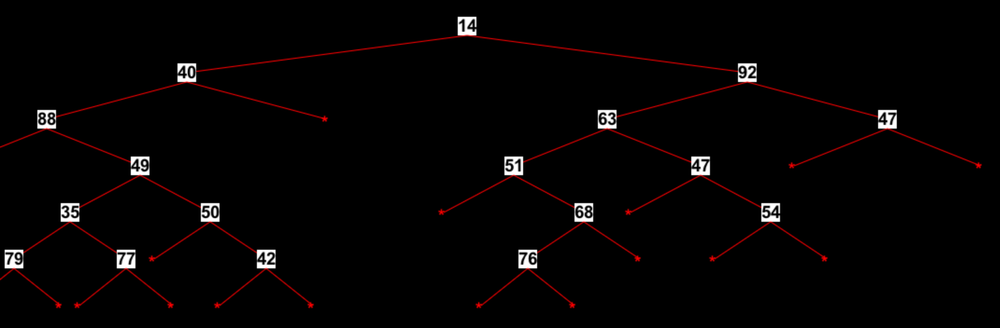

# GraphViz
Visualizations for trees and graphs in your web browser.



# How to build (and run) from source
## Setup
First, make sure [.NET 8 or later](https://learn.microsoft.com/en-us/dotnet/core/install/) is installed on your computer.

## How to Run
Clone the source code and use the `dotnet run` command to run GraphViz:

```
git clone https://github.com/brandonchastain/graphViz.git
cd graphViz/GraphViz/
dotnet run
```

You will then be able to see the visualisation in your browser by going to [https://localhost:5008](https://localhost:5008). Click the screen to generate new data.

# Features
## Binary trees
[x] Core

[x] Visualization

[x] Generate random tree


## Graphs
[ ] Core

[ ] Visualization

[ ] Generate random graph

